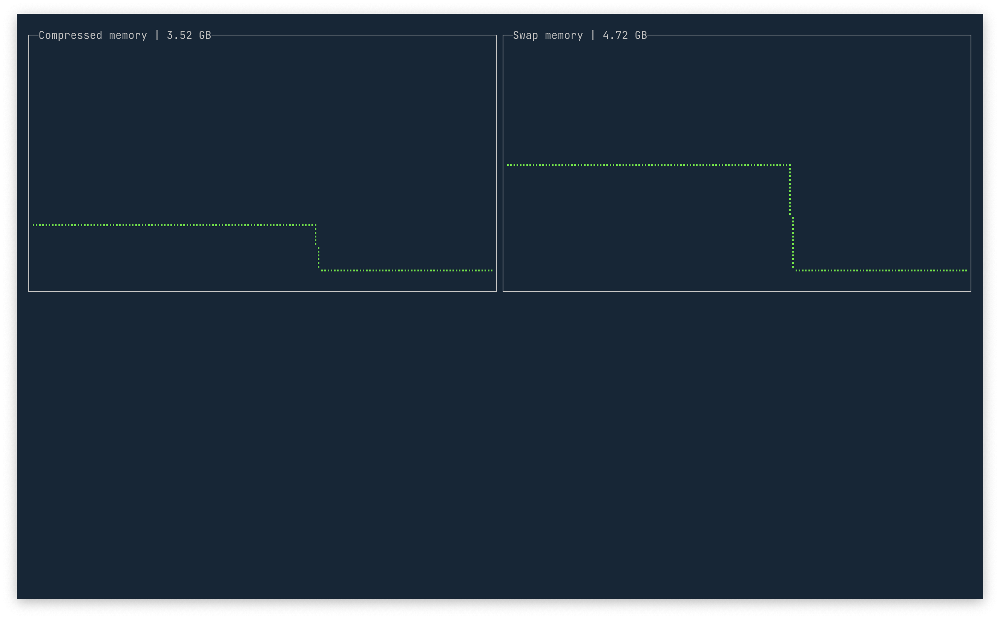

# Compressed RAM for macOS in terminal

I was interested to monitor compressed RAM in macOS and didn't find anywhere information how to get this info aside of activity monitor.

Maybe it will be helpfull somebody.

> It's not finished, no limitation for arrays, need to be done.

